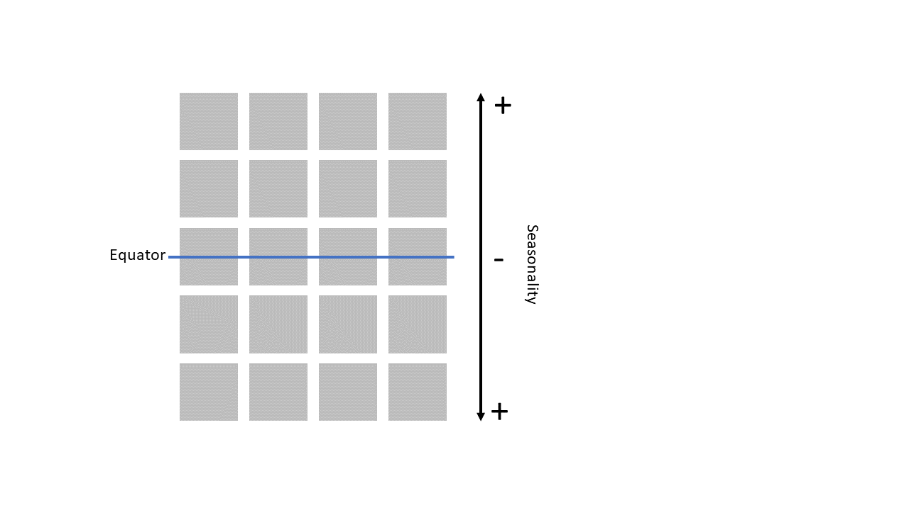

```{r, include = FALSE}
knitr::opts_chunk$set(
  collapse = TRUE,
  comment = "#>"
)
```

```{r}
library(ZikaModel)
```

## Seasonality 
The model allows to account for the effect of seasonal variations in climatic 
variables (e.g. temperature and precipitation) on Zika transmission dynamics. 
In the model, seasonality affects: 

* adult mosquitoes mortality;
* mosquito larvae carrying capacity;
* Extrinsic Incubation Period.

The magnitude and timing of seasonal variations in each patch are described by the amplitude 
and phase parameters, which were chosen to mimic the seasonality of dengue transmission in Latin America. A 5 x 4 patch structure was assumed with 8 patches above the equators (strong seasonality and peak at the start of the year), 4 at the equator (weak seasonality) and 8 below the equator (strong seasonality and peak in the middle of each year) (Figure 1). 

```{r Patch structure, echo = FALSE, fig.height = 4, fig.width = 6, dpi = 200, fig.cap = "Figure 1. Schematic of the model patch structure in relation to seasonality.", out.width = '100%'}

```


A deterministic model which includes the effect of seasonality can be implemented
with the following:

```{r}
age_init <- c(1, 9, 10, 10, 10, 10, 10, 10, 10, 10, 10)
  
deathrt <- c(1e-10, 
             1e-10, 
             1e-10, 
             0.00277068683332695, 
             0.0210680857689784,
             0.026724997685722,
             0.0525354529367476,
             0.0668013582441452,
             0.119271483740379,
             0.279105747097929,
             0.390197266957464)

# number of years to run the simulation for
time_years <- 50 # years

# time step
my_dt <- 1

# number of model time steps
time_frame <- (364 * time_years) / my_dt

# run the model
model_outputs <- run_model(agec = age_init,
                           death = deathrt,
                           nn_links,
                           amplitudes_phases,
                           time = time_frame,
                           season = TRUE)
```

Now we do post processing and plot the compartments: 

```{r, fig.height = 4, fig.width = 6}
diagnostics <- post_processing(model_outputs, my_dt)

plot_compartments(diagnostics$compartments)
```

The dynamics look more jagged compared to the baseline model due to the effect of seasonality on transmission which makes them jumping more up and down. Let's calculate and plot the rest of the diagnostics:

```{r, fig.height = 6, fig.width = 8}
plot_demographics(diagnostics$demographics)

mosquito_diagnostics <- post_processing_mos(model_outputs)

plot_demographics(mosquito_diagnostics)
```

Finally, we also plot the variables directly modified by seasonality, namely mosquito larve carrying capacity (Kc), extrinsic incubation period (eip) and adult mosquito mortality rate (delta). To simplify, we plot the average of each variable across all patches.

```{r, fig.height = 6, fig.width = 8}
season_vars <- plot_Kc_eip_delta(model_outputs)
grid::grid.draw(season_vars)
```
